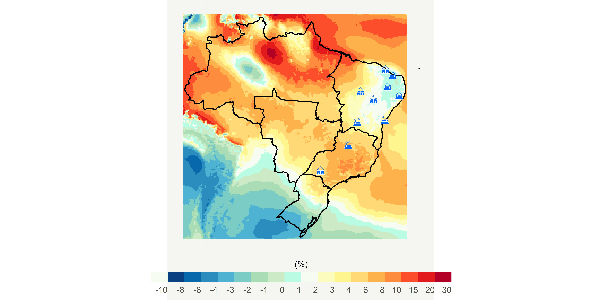
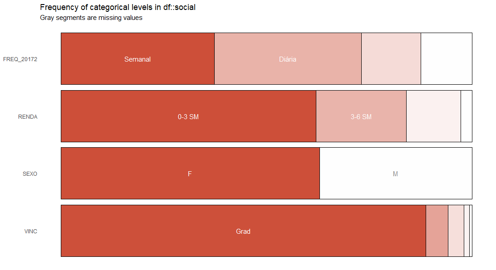
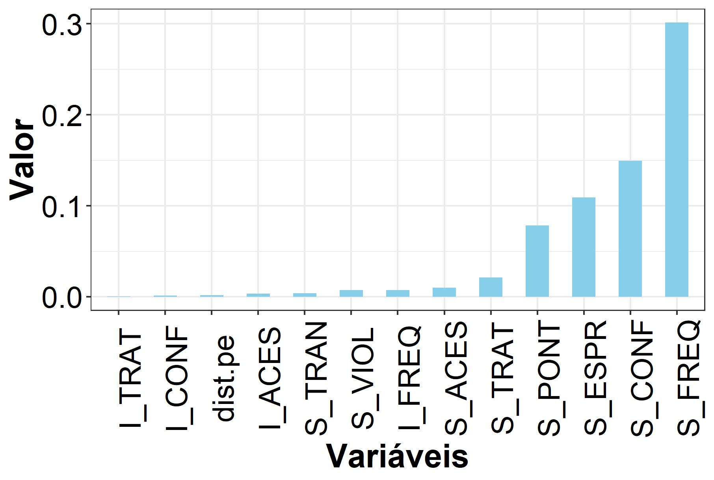
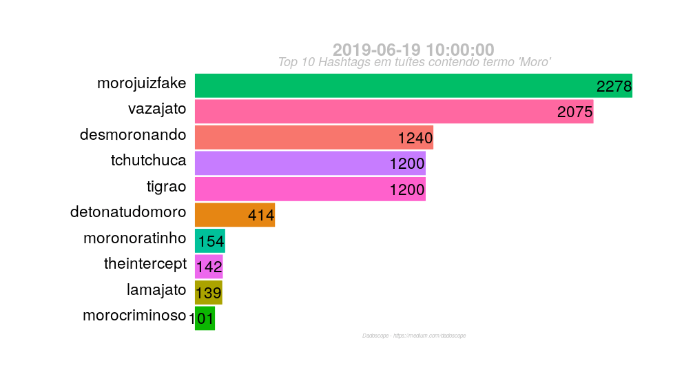
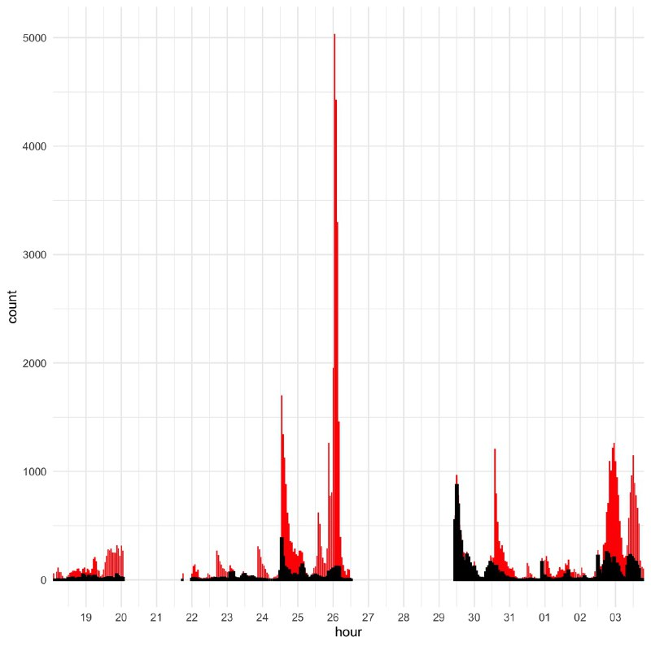
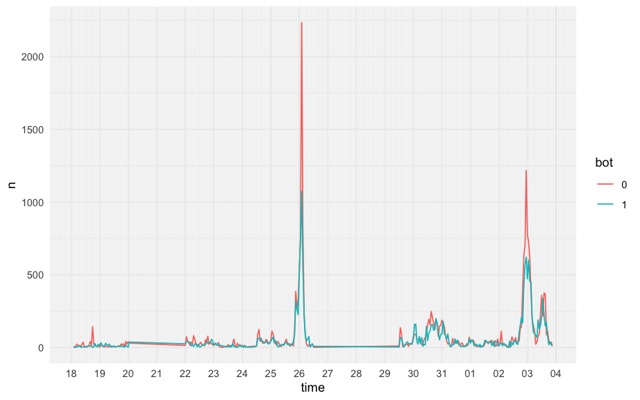

```{r setup, include=FALSE}
options(htmltools.dir.version = FALSE)
```

class: center, bottom

background-image: url(https://img.buzzfeed.com/buzzfeed-static/static/2014-06/25/11/enhanced/webdr07/anigif_enhanced-buzz-2416-1403710481-29.gif?crop=302:302;100,0&downsize=300:*&output-format=auto&output-quality=auto)
background-position: 50% 50%
background-size: contain

---

# Quem sou eu?

---

### Big Data NOW

"In addition to being able to support modeling efforts and predicting the flow of a pandemic, big data, machine learning, and other technology can quickly and effectively analyze data to help humans on the frontlines figure out the best preparation and response to this and future pandemics". (The Vital Role Of Big Data In The Fight Against Coronavirus - FORBES)

“We also have some work we've been doing in understanding social media responses to the pandemic. One project in particular has focused on tracking data from Chinese social media as coronavirus spread there in mid-January, and then comparing it to American data.” (Understanding the COVID-19 Pandemic as a Big Data Analytics Issue - James Hendler)

The COVID-19 crisis has intensified the debate over big data and privacy. Governments are pulling together data from public and private systems in order to predict and counter the spread of COVID-19. But setting aside privacy protections in a time of crisis could lead to new, permanent norms (Can Big Data Fight a Pandemic? - Yale Insights)


---
# Por que aprender R?

* Razão 01: R é uma ferramenta open-source e disponível gratuitamente;

* Razão 02: R é uma linguagem mundialmente reconhecida;

* Razão 03: R é uma poderosoa linguagem de programação;

* Razão 04: Comunidade acolhedora e 

* Razão 05: Tidyverse e uma interface estruturada de programação.

---


# R é uma ferramenta open-source e disponível gratuitamente:


"R is available as Free Software under the terms of the Free Software Foundation’s GNU General Public License in source code form: " 


* A liberdade de executar o programa, para qualquer propósito;

* A liberdade de estudar como o programa funciona e adaptá-lo às suas necessidades;

* A liberdade de redistribuir cópias de modo que você possa ajudar ao seu próximo e 

* A liberdade de aperfeiçoar o programa e disponibilizar os seus aperfeiçoamentos, de modo que toda a comunidade se beneficie deles.

---
class: center

### R é uma linguagem mundialmente reconhecida


---

class: center

### R é uma linguagem mundialmente reconhecida


---

class: center

## R é uma poderosoa linguagem de programação e pode salvar sua vida

#### Mudanças climáticas



Estimating the impact of climate change on wind and solar energy in Brazil using a South American regional climate model. 

---

## R é uma poderosa linguagem de programação e pode salvar sua vida

#### Mudanças climáticas

Autores: Pieter de Jong; Tarssio B.Barreto; Clemente A.S.Tanajura; Daniel Kouloukoui; Karla P.Oliveira-Esquerre; Asher Kiperstok; Ednildo Andrade Torres.

Desafio: 

* Aquisição de dados via [API] (https://projeta.cptec.inpe.br/);

* Mais de 1 Bilhão de dados;

* Identificar padrão de ausência de dados;

* Gerar visualização de dados.

---

### R é uma poderosa linguagem de programação e pode salvar sua vida

##### Justiça climática e territórios de informações: o caso das chuvas de abril/2019 na cidade do Rio de Janeiro (RJ).


---

### R é uma poderosa linguagem de programação e pode salvar sua vida

##### Justiça climática e territórios de informações: o caso das chuvas de abril/2019 na cidade do Rio de Janeiro (RJ).

Desafio: 

* Limpar cerca de 400 mil publicações no twitter relacionadas, inicialmente, às chuvas no Rio de Janeiro; 

* Múltiplas notícias ou eventos com destaque como o assassinato de um músico com 80 tiros, lançamento de música pelo BTS, campanha venezuelana pelos direitos dos animais e Lollapalooza.

* Transformar dados de uma rede social em informação para publicação científica.

---

### R é uma poderosa linguagem de programação e pode salvar sua vida

##### Justiça climática e territórios de informações: o caso das chuvas de abril/2019 na cidade do Rio de Janeiro (RJ).


---

### R é uma poderosa linguagem de programação e pode salvar sua vida

##### Estimação dos atributos relevantes na satisfação de usuários de transporte intercampi por random forest.



---

### R é uma poderosa linguagem de programação e pode salvar sua vida

##### Estimação dos atributos relevantes na satisfação de usuários de transporte intercampi por random forest.

Autores: Tarssio Brito Barreto, Ícaro Bernardes dos Santos Coutinho; Jorge Ubirajara Pedreira Júnior e Karla Patricia Santos Oliveira Rodríguez Esquerre

Desafio: 

* Obter informações que contribuam para a melhoria do Buzufba a partir de questionário aplicado aos usuários.

* Encontrar as variáveis mais importantes dadas opniões dos usuários;

* Estudar a correlação destas variáveis com características sociais dos usuários.
---

### R é uma poderosa linguagem de programação e pode salvar sua vida

##### Estimação dos atributos relevantes na satisfação de usuários de transporte intercampi por random forest.


---

### R é uma poderosa linguagem de programação e pode salvar sua vida

##### Estimação dos atributos relevantes na satisfação de usuários de transporte intercampi por random forest.




---

### R é uma poderosa linguagem de programação e pode salvar sua vida

##### Dadoscope


Desafios: 

* Acompanhar a velocidade de produção de conteúdo no twitter acerca da "Vaza Jato";

* Trabalhar em equipe de 5 pessoas criando código em prol de apenas uma publicação;

* Baixar de forma contínua as publicações e armazená-las;

* Gerar aproximação da comunidade com os dados.

---

### R é uma poderosa linguagem de programação e pode salvar sua vida

##### Dadoscope

<font size="4"> <b> Quem somos </b>: Somos os pescadores que se encantam mais com a rede que com o mar, como diria Oswaldo Montenegro. </font> 
<br/>
<font size="4"> <b> Charles Novaes de Santana </b>: Cientista da computação, mestre e doutor em mudanças climáticas, com experiência no uso de técnicas de inteligência artificial e de aprendizado estatístico. </font> 
<br/>
<font size="4"> <b>Tarssio Barreto</b>: Estudante de doutorado do Programa de Engenharia Industrial da Universidade Federal da Bahia. Dedica o seu tempo ao aprendizado de máquina com particular interesse na interpretabilidade de modelos black box. </font> 
<br/>
<font size="4"> <b>Fernando Barbalho </b> — Doutor em Administração pela UnB (2014). É cientista de dados no Tesouro Nacional. Pesquisa e implementa produtos para transparência no setor público brasileiro. </font> 
<br/>
<font size="4"> <b>Leonardo F. Nascimento </b>— Doutor em sociologia pelo Instituto de Estudos Sociais e Políticos — IESP/UERJ (2013). Pesquisa temas relacionados à sociologia digital e aos métodos digitais de pesquisa. Atualmente é professor do Instituto de Ciência, Tecnologia e Inovação da UFBA. </font>


---

### R é uma poderosa linguagem de programação e pode salvar sua vida

##### Dadoscope




---
# Covid-19

## Covid -19 El discurso sobre China en Twitter : nuevo orden, vieja mentalidad.

### Desafios

a) Buscar padrões de referências a China no Twitter durante a pandemia.

b) Identificar como as des-informações são propagadas na rede.

---

### Covid-19

#### Covid -19 El discurso sobre China en Twitter : nuevo orden, vieja mentalidad.


Autores: Francisca Marli Rodrigues de Andrade; Tarssio Barreto; Andrés Herrera;  Andrea Ugolini; Yu-Ting.



---

#### Covid-19

### Covid -19 El discurso sobre China en Twitter : nuevo orden, vieja mentalidad.



---

### Comunidade acolhedora

*[Telegram](https://web.telegram.org/#/im?p=@rbrasiloficial)

*[Facebook](https://www.facebook.com/groups/1410023525939155/about/)

*[RLadies](https://rladies.org/)

*[StackOverflow](https://pt.stackoverflow.com/)

*[userR](http://www.user2019.fr/)

*[Eventos](https://jumpingrivers.github.io/meetingsR/events.html)

```{r echo= FALSE, warning = FALSE, message = FALSE, fig.align='center'}


```

---

### Links: 

- http://www.storytellingwithdata.com/books  (Storytelling with Data)

- https://r4ds.had.co.nz  ( R for Data Science)

- https://www.data-to-viz.com (Data to viz)

---

# Mão na massa

* Primeiros passos: 

a) Conhecendo a interface R;

b) Criando nosso Github; 

c) Nosso primeiro projeto;

d) Nosso primeiro banco de dados via API;


---

### Nossos primeiros passos gráficos: 

```{r}

# O que é Programação Orientada a Objeto?

# https://www.codementor.io/@otrenav/object-oriented-programming-in-r-part-1-the-basics-hcgwbcdmo

# Carregando um banco de dados: 

df <- read.csv("Data/koreia_air.csv")


### Instalando o primeiro pacote

# install.packages("tidyverse")
# install.packages("esquisse")

require(tidyverse)
require(esquisse)

# Para criar gráficos: 

# esquisser(df)


```


---

# inmetr: Historical Data from Brazilian Meteorological Stations in R

* Conectando a uma API que retornará os dados pretendidos;

* http://www.inmet.gov.br/projetos/rede/pesquisa/

* Vamos criar uma conta!

---

# Instalando e carregando o pacote inmetr

```{r}

# install.packages("devtools")

library(devtools)
install_github('lhmet/inmetr')
library(inmetr)


```
---

# Carregando todo o banco de dados: 

```{r}

head(bdmep_meta)

```


* Mas teremos que editar para selecionar uma estação. E agora?

---

# Tidyverse e uma interface estruturada de programação


* Eficiência algorítmica vs eficiência de trabalho

* Tidy data

* Utilização do operador __%>%__ (pipe).

* Aparato mnemônico

* Minimalidade e funções puras

---

# Tidyverse e uma interface estruturada de programação


---


# Pipe

* Conector de funções; 

* "E então...";

* Por que usar?

```{r echo= FALSE, warning = FALSE, message = FALSE, fig.align='center'}
knitr::include_graphics("pipe.jpg")

```

---

# Energia lá em cima!!!


```{r echo= FALSE, warning = FALSE, message = FALSE, fig.align='center'}


```

---

background-image: url(https://i2.wp.com/gvnation.com/wp-content/uploads/2019/06/tumblr_ppjo4j6Hta1r3v7t2o1_500.gif?resize=500%2C231&ssl=1)
background-position: 50% 50%
background-size: contain

# Dplyr


* __filter__

* __select__

* __slice__

* __mutate__ 

* __summarise__ 

* __case_when__

---

# __filter__

```{r}

aux <- bdmep_meta


# Filtrando o Estado da Bahia


bahia <- aux %>% 
  filter(state == "Bahia")


# Filtrando: Salvador


salvador <- bahia %>% 
  filter(name == "Salvador (Ondina)")


# Por fim atribuiremos o ID:

id <- salvador$id

```

---

# Acessando a API e buscando os dados: 

```{r}

start_date <- "01/01/1961"

end_date <- format(Sys.Date(), "%d/%m/%Y")

met_data <- bdmep_import(id = id,
                         sdate = start_date, 
                         edate = end_date, 
                         email = "tarssio.disap@hotmail.com",
                         passwd = "9mks3vfn",
                         verbose = TRUE)
```

---

### Primeiros ajustes na precipitação: 

__select__

```{r}

prec <- met_data %>% 
  select(date, prec) %>% 
  na.omit()

```

---

# Agregando ano a ano

__lubridate__  + __mutate__


```{r}

library(lubridate)


prec <- prec %>% 
  mutate(year = year(date))

```

---

# Como agregar?


__group_by__ + __summarise__

```{r}

prec_anual <- prec %>% 
  group_by(year) %>% 
  summarise(prec = sum(prec))


```

---
# Visualizando: 

```{r eval = FALSE}

require(ggplot2)


ggplot(prec_anual) +
 aes(x = year, y = prec) +
 geom_area(size = 1L) +
 theme_minimal()
```

---

# Visualizando: 

```{r echo = FALSE}

require(ggplot2)


ggplot(prec_anual) +
 aes(x = year, y = prec) +
 geom_area(size = 1L) +
 theme_minimal()
```

---
